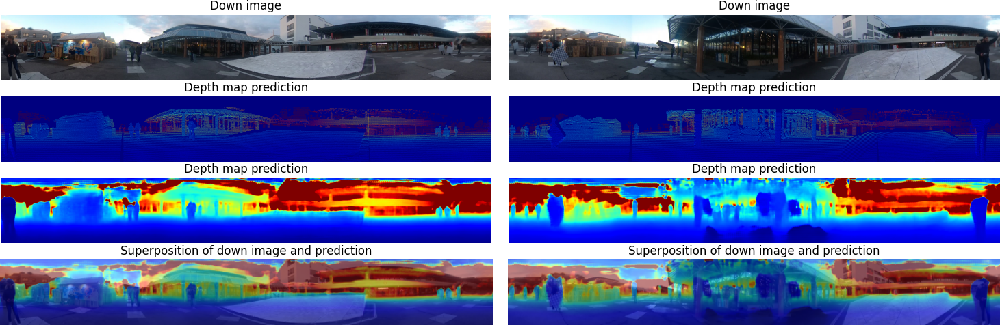

# Semester Project | 360° Stereo Depth Estimation with Learnable Cost Volume on Real-World Data 

In this project, we developed an innovative system for creating a dataset tailored for 360-degree stereo imaging. The setup comprises two 3D cameras positioned one above the other, with a LiDAR sensor situated between them. This arrangement captures sequences of images simultaneously with LiDAR data, we then enable the precise mapping of LiDAR point clouds onto the upper camera's images. In the second phase of the project, we trained a specialized neural network model for depth estimation, named 360SD-Net, using this newly compiled dataset. Notably, the 360SD-Net model is a stereo model specifically adapted for 360-degree images. Prior to this project, it had only been trained on synthetic data, as a real-world dataset of this nature did not exist. The outcomes of our study, including results and implementation details, can be accessed in this project repository.

# 360SD-Net
[project page](https://albert100121.github.io/360SD-Net-Project-Page/) | [paper](https://arxiv.org/abs/1911.04460v2) | [dataset](https://forms.gle/GuxNQ6NLmi9yHc829)

This is the implementation of the [ICRA 2020](https://www.icra2020.org/) paper "360&deg; Stereo Depth Estimation with Learnable Cost Volume" by [Ning-Hsu Wang](http://albert100121.github.io/) adapted for our dataset.

Overview 
--- 
<p align="center">

</p>

# DOWNLOAD Dataset
## Download Stereo360 Dataset
```
>> cd ./data
```
Here is the google drive containing the necessary dataset : https://drive.google.com/drive/folders/1LGvywrdu8ZWg8D2k0ZTvx1HXjzLy1kZL
Once downloaded add it to the data folder.

Setup data and directories (opt to you as long as the data is linked correctly). Set the directory structure for data as follows: 

## Stereo 360 Dataset
```
./data/
     |--Stereo360/
                 |--train/
                       |--image_up/
                       |--image_down/
                       |--disp_up/
                 |--val/
                       |--image_up/
                       |--image_down/
                       |--disp_up/
                 |--test/
                       |--image_up/
                       |--image_down/
                       |--disp_up/
```
# Training and testing

## Training procedure:
### For Stereo360 Dataset
```
>> python main.py --datapath data/Stereo360/train/ --datapath_val data/Stereo360/val/ --batch 2
```
## Testing prodedure:

### For Stereo360 Dataset
This will evalute of the data in datapath on the model chosen with checkpoint
```
>> python evaluate.py --datapath data/Stereo360/test/ --checkpoint checkpoints/Stereo360_checkpoint/checkpoint.tar --outfile output/Stereo360
```

This will create the depth estimations (as .npy) of the data in datapath
```
>> python testing.py --datapath data/Stereo360/test/ --checkpoint checkpoints/Stereo360_checkpoint/checkpoint.tar --outfile output/Stereo360
```
Notes
---
* The training process will cost a lot of GPU memory. Please make sure you have a GPU with 120G or larger memory.

Exemple Results
---
* Qualitative results : Depth


Citation
---
```
@article{360sdNet,
  title={360SD-Net: 360° Stereo Depth Estimation with Learnable Cost Volume},
  author={Ning-Hsu Wang, Bolivar Solarte, Yi-Hsuan Tsai
Wei-Chen Chiu, Min Sun},
  journal={ICRA},
  year={2020}
}

@article{PSMNet,
  title={Pyramid Stereo Matching Network},
  author={Jia-Ren Chang, Yong-Sheng Chen},
  journal={IEEE},
  year={2018}
}

@article{Kitti,
  title={KITTI-360: A Novel Dataset and Benchmarks for Urban Scene Understanding in 2D and 3D},
  author={Yiyi Liao, Jun Xie, Andreas Geiger},
  journal={IEEE},
  year={2021}
}

@article{DrivingStereo,
  title={DrivingStereo: A Large-Scale Dataset for Stereo Matching in Autonomous Driving Scenarios},
  author={Guorun Yang, Xiao Song, Chaoqin Huang, Zhidong Deng, Jianping Shi, Bolei Zhou},
  journal={CVPR},
  year={2019}
}

@article{MP3D,
  title={Matterport3D: Learning from RGB-D Data in Indoor Environments},
  author={A. Chang, A. Dai, T. Funkhouser, M. Halber, M. Niessner, M. Savva, S. Song, A. Zeng, Y. Zhang},
  journal={International Conference on 3D Vision},
  year={2017}
}
```

